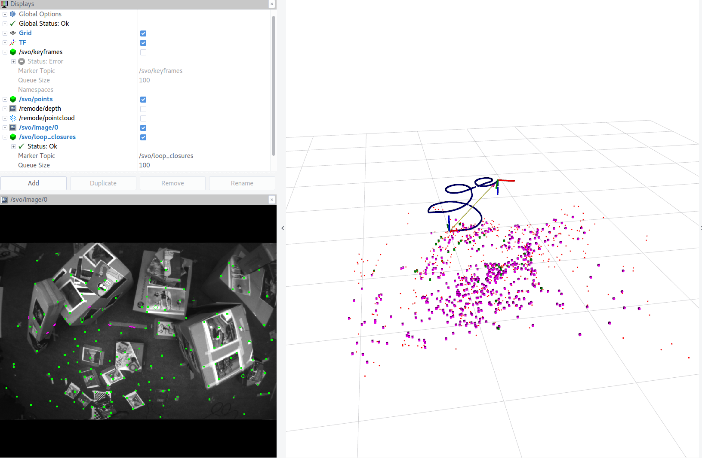
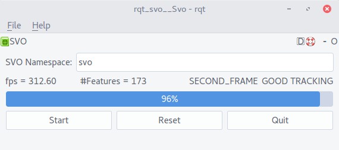

### Prerequisites
#### System
Make sure your system meets the following requirements:

* Ubuntu 14.04 64 bit
* gcc version 4.8
* ROS version `indigo` ([installation guide](http://wiki.ros.org/indigo/Installation/Ubuntu)).

or

* Ubuntu 16.04 64 bit
* gcc version 5.4
* ROS version `kinetic` ([installation guide](http://wiki.ros.org/kinetic/Installation/Ubuntu)).

We also support ARM architecture (tested on Odroid XU3/4) for

  * Ubuntu 14.04 32 bit
  * gcc version 4.8
  * ROS version `indigo`

If you have multiple `gcc` installed, make sure the aforementioned version is the default one (use `update-alternatives`).

#### Install catkin tools
We use [catkin tools](https://catkin-tools.readthedocs.io/en/latest/) to build workspace. Use catkin 0.3.1:

    sudo apt-get install python-pip
    sudo pip install catkin-tools==0.3.1

Remember to remove the previous version that you are using.


### Install

If you are compiling on an ARM processor, make sure the `ARM_ARCHITECTURE` environment variable is defined, for example:
```
export ARM_ARCHITECTURE=armv7-a
```

#### Create the install workspace
Copy the `svo_install_ws` to where you want to install the binaries (e.g., your home folder in this documentation):

    cp -r <extracted folder>/svo_install_ws/ ~/

Now we should have a folder `~/svo_install_ws` with a subfolder named `install`.

Run the script within the workspace to fix some hardcoded paths:

    cd ~
    cd svo_install_ws
    ./fix_path.sh

There may be some warnings with `opengv`, which can be safely ignored.

#### Create an overlay workspace
Now we will create a workspace to use the binaries we just downloaded. Before proceeding, make sure you have already source the setup file from ROS :

    source /opt/ros/<your ros version>/setup.bash

Then source the install workspace:

    cd ~
    source svo_install_ws/install/setup.bash

Create a new catkin workspace:

    mkdir svo_install_overlay_ws && cd svo_install_overlay_ws
    catkin config --init --mkdirs --cmake-args -DCMAKE_BUILD_TYPE=Release

Now, this workspace should overlay both the ros installation and the `svo_install_ws`. Typing `catkin config`, you should see:

    Extending:    [env] /home/<user>/svo_install_ws/install:/opt/ros/<ros version>

Copy the `rpg_svo_example` folder to the `src` folder and build the `svo_install_overlay_ws`

    cp -r <extracted folder>/rpg_svo_example ~/svo_install_overlay_ws/src
    cd ~/svo_install_overlay_ws
    catkin build

### Validate Your Installation

If you are using an ARM processor, follow  the instructions in `run_on_arm.md` from this point.

Source the setup file of the overlay workspace:

    source ~/svo_install_overlay_ws/devel/setup.bash

Download the test bag from [here](http://rpg.ifi.uzh.ch/svo2/svo_test_short.bag). Then run the following commands:

    roslaunch svo_ros run_from_topic.launch cam_name:=svo_test_pinhole
    rosbag play svo_test_short.bag

Then you should be able to observe the camera motion and the sparse map in RVIZ, as shown below



You can also check the number of feature tracked and the pipeline status in the following rqt window



At the first launch, the `SVO Namespace` may be incorrect and the information is not displayed. Simply typing `svo` as shown in the screenshot will solve the problem.
